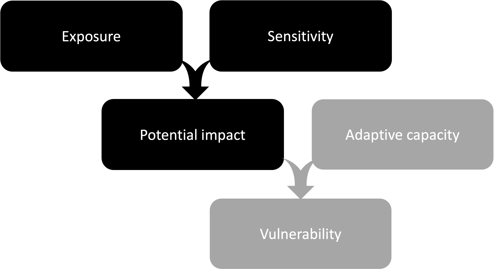

```{r setup, include=FALSE}

knitr::opts_chunk$set(echo = TRUE)

```

<head>

<meta name="robots" content="noindex">

</head>

```{=html}
<style type="text/css">

.watermark {
  opacity: 0.2;
  position: fixed;
  top: 50%;
  left: 50%;
  font-size: 500%;
  color: #000000;
}

.blackbox {
 padding: 1em;
  background: black;
  color: white;
  border: 2px solid orange;
  border-radius: 10px;
}
.center {
  text-align: center;
}

</style>
```


# Results

::: {.blackbox data-latex=""}
::: {.center data-latex=""}
**This work is in the draft stage and all methods & results should be considered preliminary and subject to change.**
:::

The widgets allow exploration of **draft** results for freshwater climate exposure of lake-type sockeye in the Fraser region. Please see the [Background](#background) and [Methods](#methods) sections for further information on what is shown.

:::

```{r echo = FALSE, message=FALSE, warning=FALSE, results = 'hide'}

# Load packages and outputs

library(colorRamps)
library(mapproj)
library(proj4)
library(sf)
library(dplyr)
library(wesanderson)
library(ncdf4) # package for netcdf manipulation
library(zoo) # package with rollmean function
library(shiny)

cols <- wes_palette("Darjeeling1")

root_dir <- "../freshwater/"
###############################################################################
# Load background spatial layers
###############################################################################

# Set broad bounds for clipping broad spatial layers
bounds <- c(xmin = -124.5, ymin = 50.85, xmax = -123.6, ymax = 51.7)

# Load shapefiles silencing sf messages


#------------------------------------------------------------------------------
# Lakes, rivers, and shorelines
#------------------------------------------------------------------------------

bounds0 <- c(xmin = -127, ymin = 49, xmax = -116.5, ymax = 56)
lakes0 <- readRDS(paste0(root_dir, "data/spatial/layers/waterbodies_lowRes.rds")) # %>% st_crop(bounds)
rivers0 <- readRDS(paste0(root_dir, "data/spatial/layers/watercourse_lowRes.rds")) #%>% st_crop(bounds)
shoreline <- st_read(dsn = paste0(root_dir, "data/spatial/layers/GSHHS_i_L1.shp"))

#------------------------------------------------------------------------------
# Spawning Zone of Influence: Fraser SEL
#------------------------------------------------------------------------------

spawn_zoi <- st_read(dsn = paste0(root_dir, "data/spatial/ZOI/fraser-spawning-zoi/fraser_spawning_zoi_SEL.shp")) %>% st_transform(crs = 4269)

#------------------------------------------------------------------------------
# Adult migration lines: Fraser SEL
#------------------------------------------------------------------------------
mig_paths <- st_read(dsn = paste0(root_dir, "data/spatial/fw-migration/spawn_timing_migration_paths_wCU_fraser.shp")) %>% st_transform(crs = 4269)

#------------------------------------------------------------------------------
# Conservation Unit Boundaries: SEL
#------------------------------------------------------------------------------

# PSF version of shapefiles
shp_path <- paste0(root_dir, "data/spatial/CU-boundaries/PSF_CUs_updatedDec2021")
cu_boundary <- st_read(dsn = paste0(shp_path, ".shp"), promote_to_multi = FALSE) %>%
  subset(regionname == "Fraser" & species %in% c("Lake sockeye", "Sockeye-Lake"))


###############################################################################
# Create space variables for plotting
###############################################################################

grid_points <- read.csv(paste0(root_dir, "output/PCIC-grid-points_Fraser.csv")) %>%
  st_as_sf(coords = c("lon", "lat"), crs = 4269)

#------------------------------------------------------------------------------
# List of CUs in the PSE
#------------------------------------------------------------------------------

cu_list <- read.csv("../data/cu_list.csv") %>% 
  subset(Species == "Lake sockeye" & Region == "Fraser" & Notes != "Extinct")

n.CUs <- length(unique(cu_list$Conservation.Unit))

#------------------------------------------------------------------------------
# Timing
#------------------------------------------------------------------------------

timing <- read.csv(paste0(root_dir, "output/freshwater_timing_FraserSEL.csv"))

###############################################################################
# Load output
###############################################################################
fw_output <- readRDS(paste0(root_dir, "output/freshwater_output_FraserSEL_2023-09-28.rds"))
# dimensions:
#   gcms$modelName,
#   cu_list$Conservation.Unit, 
#   stages,
#   c("optimalTemp", "criticalTemp", "optimalFlow", "criticalFlow"),
#   c("hist", "early", "mid", "late"), 
#   c("median", "lower", "upper")))

#------------------------------------------------------------------------------
# Define stages
#------------------------------------------------------------------------------
stages <- dimnames(fw_output)[[3]]
stages.all <- c(stages, "early_marine", "marine_rearing")
stage.names <- c(c("Adult\nmigration", "Spawning", "Incubation", "Freshwater\nrearing", "Early\nmarine", "Marine\nrearing"))
oj <- rev(c(3, 4, 5, 6, 1, 2)) # Order in which we want stages to appear

#------------------------------------------------------------------------------
# How much time does each CU spend in each stage?
#------------------------------------------------------------------------------
numDays <- array(NA, dim = c(n.CUs, 4), dimnames = list(cu_list$Conservation.Unit, stages))
for(i in 1:n.CUs){
  for(j in 1:4){
    numDays[i,j] <- timing$n.days[which(timing$culabel == cu_list$Conservation.Unit[i] & timing$stage == stages[j])]
  }}

```


**Below**: The proportion of days above (stream temperature) or below (low flow) the threshold (see [Methods](#methods)) for each applicable life stage of a selected CU in the historical (1970-1999), early-century (2010-2039), mid-century (2040-2069), and late-century (2070-2099) periods. The average number of days in each life stage for the selected CU is shown on the right side of the graph. Users can choose between stream temperature and low flow using the left drop-down menu, and select a CU using the right drop-down menu. **Note** that these results are only available for Fraser lake-type sockeye at this point.

```{r echo = FALSE}
#------------------------------------------------------------------------------
# set colour palette
#------------------------------------------------------------------------------
col_levels <- seq(0, 0.9, 0.1)
n <- length(col_levels)
col_palette <- paste0(colorRampPalette(colors = cols[c(5,3,1)])(n = length(col_levels) + 1))

#------------------------------------------------------------------------------
# Shiny app for CU-level plots
#------------------------------------------------------------------------------

shinyApp(

  ui = fluidPage(
    fluidRow(
      column(width = 4,
             selectInput("var", "Climate change attribute:",
                choices = c("Stream temperature", "Low flow"))
             ),
      column(width = 6, 
              selectInput("cu", "Conservation Unit:",
                choices = cu_list$Conservation.Unit)
             )
      ), # end fluidRow
    plotOutput("CUplot")
  ),

  server = function(input, output) {
    output$CUplot = renderPlot({

      # Set selections
      i <- which(cu_list$Conservation.Unit == input$cu)
      k <- c(1,3)[match(input$var, c("Stream temperature", "Low flow"))]

      # Initiate plot
       par(mar =c(4, 8, 5, 3), bg = "white")
    plot(c(0, 1), c(0.5, 6.5), "n", yaxt ="n", bty = "n", xlab = "Proportion of days", ylab = "", xaxs = "i", yaxs = "i", xaxt = "n")

    # Add colour legend at bottom
    for(q in 1:n){
      polygon(x = c(0, 1/n, 1/n, 0)+ (q-1) * 1/n, y = c(0, 0, 0.5, 0.5), border = NA, col = col_palette[q], xpd = NA)
    }

    axis(side = 1, tck = -0.02)
    abline(h = c(1:6) + 0.5, xpd = NA)
    segments(x0 = 0, y0 = 0.5, x1 = 0, y1 = 6.5, xpd = NA)
    segments(x0 = seq(0, 1, 0.1), y0 = 0.5, x1 = seq(0, 1, 0.1), y1 = 6.5, col = grey(0.8), xpd = NA)
    segments(x0 = 0, y0 = 0.5, x1 = -10, y1 = 0.5, xpd = NA)

    text(rep(-0.1, 6), c(1:6), stage.names[oj], xpd = NA)

    # Grey out marine stages
    polygon(x = c(-10, 10, 10, -10), y = c(2.5, 2.5, 4.5, 4.5), col = "#00000030", border = NA, xpd = NA)
    text(rep(0.5, 2), c(3, 4), "Not Applicable", col = "white", font = 2)

    for(j in 1:4){
      for(p in 1:4){
        x <- median(fw_output[, i, j, k, p, 1])
        pCol <- col_palette[findInterval(x, col_levels)]

        points(
          x,
          oj[j] + c(-0.3, -0.1, 0.1, 0.3)[p],
          col = pCol,
          bg = pCol,
          pch = c(22, 25, 21, 24)[p],
          cex = 1.5, xpd = NA)
        segments(
          x0 = min(fw_output[, i, j, k, p, 1]),
          y0 = oj[j] + c(-0.3, -0.1, 0.1, 0.3)[p],
          x1 = max(fw_output[, i, j, k, p, 1]),
          y1 = oj[j] + c(-0.3, -0.1, 0.1, 0.3)[p],
          col = pCol,
          lwd = 1.5
        )

      } # end p
      text(1.03, oj[j], numDays[i,j], xpd = NA, font = 2)
    } # end j

    legend(-0.2, 7.2, ncol = 4, pch = c(22, 25, 21, 24), pt.cex = 1.5, col = 1, pt.bg = 1, c("Historical", "Early-century", "Mid-century", "Late-century"), xpd = NA, bty = "n", bg = NA)

    mtext(side = 3, paste0("Fraser SEL - ", input$cu, "\n", input$var), line = 3)


    })
  },

  options = list(height = 500, width = 800)
)

```

# Background

Climate Change Vulnerability Assessments (CCVAs) aim to describe how climate change may impact certain valued attributes of a particular system to inform the identification and prioritization of conservation and mitigation actions. Although CCVAs have been performed for salmon [e.g., @Crozier2019; @crozier2021] and steelhead [@Wade2013] in the US, there is no analogous information available for Canadian populations. In 2021, the Pacific Salmon Foundation's Salmon Watershed Program received funding from the BC Salmon Restoration and Innovation Fund (BC SRIF) to, in part, undertake CCVAs for salmon in BC and share that information via the [Pacific Salmon Explorer](https://www.salmonexplorer.ca). We are interested in understanding the potential impact of climate change on the viability of Pacific salmon and steelhead Conservation Units (CUs), with the aim to understand which CUs are likely to be most strongly affected and why.

We initially set out to quantify three components of vulnerability:

1\. Exposure to climate change, based on projected environmental variables such as stream temperature, flow, and sea surface temperature in future periods;

2\. Sensitivity of both CUs and their habitats to those projected changes, which might be influenced by characteristics such as life-history timing (CUs) or degree of degradation (habitats);

3\. Adaptive capacity of CUs to change in ways that minimize the impact of climate change, which can depend on characteristics of the CU such as populations size and life-history flexibility.

Here, we describe our current approach and draft results for quantifying the **potential impact** of climate change on salmon and steelhead CUs, defined as the combination of exposure and sensitivity (see below).

```{r ccva-framework, include=TRUE, echo = FALSE, out.width='80%', fig.align='center', fig.cap='A common conceptual framework for Climate Change Vulnerability Assessments describes three components of vulnerability, with **exposure** and **sensitivity** combining to yield the **potential impact**, which is then evaluated in light of the **adaptive capacity** of the system to arrive an overall **vulnerability**. Here we describe our efforts to quantifying potential impact (black boxes) on Pacific salmon and steelhead conservation Units.'}

```

# Methods

## Life stages

For each CU, we assessed exposure to climate changes for each of six life stages, defined based on life-history timing and spatial distribution as described in the following table. We put considerable effort into compiling life-history timing data, particularly for freshwater juvenile life stages, and the details of that exercise can be found [here](https://bookdown.org/salmonwatersheds/life-cycle-timing).

| Stage                      | Timing                                                      | Spatial distribution                                                                             |
|------------------|---------------------------|---------------------------|
| Incubation                 | Start of spawning to end of fry migration                   | Spawning Zone of Influence                                                                       |
| Freshwater juvenile        | Start of fry migration to end of ocean entry                | Freshwater rearing lake (SEL) or watersheds and downstream migration route from spawning grounds |
| Early marine               | 3 months before to 3 months after peak ocean entry date     | A 400 - 750 km buffer zone around point of marine entry                                          |
| Marine rearing             | 4 months after ocean entry to end of run timing             | North Pacific\*                                                                                  |
| Adult freshwater migration | Start of run timing (freshwater entry) to start of spawning | Migration route(s) from freshwater entry point to spawning grounds                               |
| Spawning                   | Start to end of spawning period                             | Spawning Zone of Influence                                                                       |

We note that some of these stages will exceed 365 days, meaning that multiple cohorts from a CU may overlap in habitat use. For example, if fry migration typically begins May 1st and ocean entry typically ends July 1st the following year (i.e., the juvenile rearing stage lasts 465 days), then simple calculating exposure over a 365-day window would ignore the greater influence of the period May 1st - July 1st when cohorts overlap. As such, when calculating exposure or assessing historical temperature distributions, we considered cohorts rather than years, and thus "double-counted" projected climate data over periods of overlap.

## Freshwater exposure

We based our assessments of freshwater exposure on downscaled hydrologic model projections of daily mean stream temperature and flow provided by the [Pacific Climate Impacts Consortium (PCIC)](https://www.pacificclimate.org). PCIC's [Gridded Hydrologic Model Output](https://www.pacificclimate.org/data/gridded-hydrologic-model-output) does not currently display stream temperature and flow, and the data we used were provided directly (M. Schnorbus, pers. comm.) and should be considered **preliminary**. Daily projections were provided from 1945 to 2099, on a spatial grid 1/16th of a degree (\~ 30 km) for six different Global Climate Models from the CMIP5 ensemble, under the RCP 4.5 emissions scenario [@PCIC2020]. The current analysis only includes the Fraser basin, but we anticipate that additional regions will be added as the hydrologic downscaling is complete.

### Stream temperature

We smoothed stream temperature using the 7-day running **maximum** of the modelled daily mean (`7DMax`), which is close to the 7-day mean of the daily maximum - a statistic that is widely regarded as relevant for fish exposure to high temperatures [@USEPA2003]. Exposure to stream temperature was calculated in each applicable grid cell for each life stage as the proportion of days in the stage timing window in which the `7DMax`exceeded the temperature threshold.

Temperature thresholds were set in each grid cell based on the distribution of temperatures over the stage window in the historical period (1970-1999). Using a temperature threshold based on the historical model output, rather than general absolute temperature thresholds that have been suggested by some agencies [@USEPA2003; @Oliver2001], recognizes that the gridded model output is an abstraction and may not represent actual stream-level temperatures experienced by individual fish. Thus, comparisons of change in future periods may be more accurate. We specifically used the 90th quantile of the historical temperature distribution, based on experimental evidence that the aerobic scope of locally adapted salmon populations is related to the distribution of historical temperatures experienced by that population, and declines above the \~90th quantile of historical temperatures [@Eliason2011].

### Stream flow

We smoothed flow using the 7-day running mean of the daily flow to bettre capture extended periods of low flow that may be harmful to fish. As for stream temperature, for each grid cell we calculated the proportion of days for each life stage that flow was below a threshold of 20% mean annual discharge (MAD). The 20% MAD threshold was set for each grid cell based on the mean annual discharge in the historical period (i.e., mean of all daily flows in 1970-1999).

We recognize the potential importance of high flows in impacting salmon under climate change, and are currently working to determine if there is a generalizable approach to summarizing changes in high flow that are relevant to salmon. Unlike low flows, the impact of high flows (e.g. measured as some % MAD) will be substantially different depending on the hydrology of a particular stream. For example, the same discharge will result in vastly different conditions for salmon in a tight canyon versus a broad flood plain. There is also a site-specific distinction between high channel-forming flows that are beneficial for salmon and damaging high flows that can flush out eggs and junveiles or impede migrations, making it challenging to apply a common approach across a broad geography.

## Marine exposure 

Marine exposure attributes that have readily available projections include sea surface temperature, sea surface salinity, sea level rise, ocean pH, and primary productivity. We are currently working to develop relevant thresholds and assess exposure to these marine attributes.

## Summarizing output 

We summarized exposure of life stages within a CU by taking the median proportion of days above threshold across all grid cells within the spatial distribution of that stage. We then repeated the above calculations for each of 6 different GCMs, and report the median and range in the proportion of days across the GCMs.

The range across GCMs captures some of the uncertainty in how climate change will progress, and differences among GCMs in their projections tend to increase further into the future. This range does not account for the spatial variability in exposure across grid cells - we also calculated the median exposure in each grid cell across GCMs to provide a visual representation on a map of how geographically variable exposure was.


# References